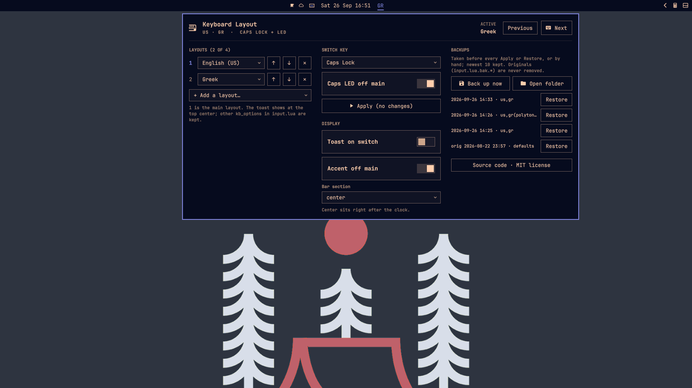

# Keyboard Layout for Omarchy

**See which keyboard layout you're typing in, switch it in one move, and set up your layouts without editing config files.**

An [Omarchy](https://omarchy.org/) bar widget for anyone who types in more than one language. It works with any language: English + Greek, German + Russian, Portuguese + Arabic, … up to four layouts.



## What you get

- **The layout on your bar.** A short label such as `EN`, `GR` or `DE`. Hover it for the full name, e.g. *Greek (polytonic)*.
- **Switching your way.** Right-click or scroll on the label, press your switch key, or bind a Hyprland key. Middle-click jumps straight back to your main layout.
- **Every keyboard at once.** Laptop keyboard, USB receiver, second keyboard: they all switch together and never end up on different layouts.
- **Setup in a panel, not a text editor.** Pick layouts and variants from a searchable list of 750+, choose a switch key (Caps Lock, Alt+Shift, Ctrl+Shift, and 12 more), then press Apply.
- **Safe with your config.** Only the layout settings in `~/.config/hypr/input.lua` are touched. Your comments and your other options stay as they are. A backup is taken before every change, and any backup can be restored with one click.
- **Optional extras, off by default.** A small toast at the top center of the screen when the layout changes, and an accent colour on the label while you're off your main layout.

## Quick start

```sh
omarchy plugin add https://github.com/Somnius/Keyboard-Layout-for-Omarchy.git --enable
```

1. The widget appears on the bar, and the first time it asks whether it should sit **next to the clock** or on the **right**.
2. **Left-click** the label to open the panel. Under **Layouts**, keep **English (US)** as layout 1 and add your other layouts (type to search, e.g. `greek` or `polytonic`).
3. Choose a **Switch key** and press **Apply & reload Hyprland**. Done.

## Using it

| On the bar label | Does |
|---|---|
| **Left-click** | Opens the panel |
| **Right-click** or **scroll down** | Next layout |
| **Scroll up** | Previous layout |
| **Middle-click** | Main layout (layout 1) |
| **Hover** | Full layout name |

The panel has three columns, and fewer on narrow screens:

- **Layouts.** Up to four, with variants. Reorder with ↑ ↓ and remove with ✕. Layout 1 is your *main* layout.
- **Switch key & Display.**
  - **Switch key:** the key that cycles layouts, with an optional Caps Lock LED that lights while you're off the main layout.
  - **Apply:** saves the layout and switch-key settings and reloads Hyprland.
  - **Display:** the toast, the accent label, and where the widget sits on the bar.
- **Backups.** Back up now, open the backups folder, or restore any earlier version.

### Keep English (US) as layout 1 if you type passwords in English

Lock screens and password prompts often start on your main layout. If layout 1 is Greek, for example, a password typed in English comes out as Greek characters and is rejected. The panel warns whenever layout 1 isn't English (US), and asks you to confirm before applying such a change.

## Keybindings and scripting

Every panel action is also a command:

```sh
omarchy-shell lef.keyboard-layout next          # or: prev, set 0, set gr, set 'gr(polytonic)'
omarchy-shell lef.keyboard-layout status        # current state as JSON
omarchy-shell lef.keyboard-layout backup        # back up input.lua now
omarchy-shell lef.keyboard-layout toast on      # or off
```

Hyprland binding example (`~/.config/hypr/bindings.lua`). This pairs well with the **None** switch key:

```lua
o.bind("SUPER + ALT + K", "Next keyboard layout", "omarchy-shell lef.keyboard-layout next")
o.bind("SUPER + ALT + J", "Main keyboard layout", "omarchy-shell lef.keyboard-layout set 0")
```

The full command list is in [docs/IPC.md](docs/IPC.md).

## What it changes on your system

| File | When | What |
|---|---|---|
| `~/.config/hypr/input.lua` | Only when you press **Apply** or **Restore** | `kb_layout`, `kb_variant`, and the layout-switch part of `kb_options`. Everything else in the file is left as it is. |
| `~/.config/omarchy/keyboard-layout/config.json` | When you change a panel setting | Placement, toast, and accent label |
| `~/.config/omarchy/keyboard-layout/backups/` | Before every Apply or Restore, or on **Back up now** | Copies of `input.lua`. The newest 10 are kept. |

Nothing else is changed: no system files, and no root access is needed. Details: [docs/CONFIGURATION.md](docs/CONFIGURATION.md) and [docs/BACKUPS.md](docs/BACKUPS.md).

## Requirements

Omarchy with its shell (Quickshell), Hyprland, `xkbcli`, and Perl with core modules only. All of these ship with Omarchy. Nothing extra needs installing.

## Documentation

- [docs/CONFIGURATION.md](docs/CONFIGURATION.md): every setting, the switch-key list, what is written where.
- [docs/BACKUPS.md](docs/BACKUPS.md): when backups happen, restoring, the backups folder.
- [docs/IPC.md](docs/IPC.md): all commands and the `status` format.
- [docs/ARCHITECTURE.md](docs/ARCHITECTURE.md): how it works inside, and its safety guarantees.

## Development

From a local checkout of this repository:

```sh
ln -s "$PWD" ~/.config/omarchy/plugins/lef.keyboard-layout
omarchy restart shell
```

- Run the tests with `tests/run.sh`, which runs the QML logic suite and the Perl I/O suites.
- Validate the manifest with `omarchy plugin validate .`.
- Quickshell's file watcher doesn't follow symlinks, so run `omarchy restart shell` after editing.

## Upgrading from 1.1.x

- Your current settings are picked up as they are.
- The old *Primary / Second* choice is replaced by up to four layout rows.
- The one-time `input.lua.bak.<timestamp>` next to `input.lua` is still listed and restorable, but new backups go to the backups folder.
- Moving the widget no longer restarts the shell.

## Uninstall

```sh
omarchy plugin remove lef.keyboard-layout
```

Your last-applied layout settings stay in `input.lua`. Remove `~/.config/omarchy/keyboard-layout/` as well if you don't want to keep the backups.

## License

[MIT](LICENSE)
